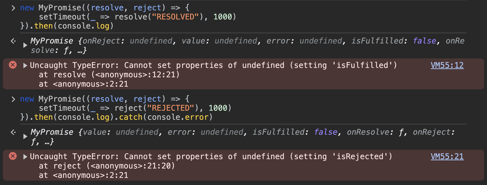

My intention here is to write a one-stop article to summarise how one would write all the polyfills for Promise and its static methods.

<!--truncate-->

## Topics covered

1. [`new Promise(cb)`](#new-promisecb)
2. [`Promise.resolve`](#promiseresolve)
3. [`Promise.reject`](#promisereject)
4. [`Promise.withResolvers`](#promisewithresolvers)
5. [`Promise.race`](#promiserace)
6. [`Promise.any`](#promiseany)
7. [`Promise.allSettled`](#promiseallsettled)

### `new Promise(cb)`

Here's what a typical promise syntax looks like:

```js
const transaction = new Promise((resolve, reject) => {
	try {
		...
		// do something async
		...
		if(success) {
			resolve("💰💰💰")
		}
	} catch (err) {
		console.error(err)
		reject("Transaction failed")
	}
	
	if(somethingWrong){
		reject("Transaction failed")
	}
})
.then(console.log) // logs "💰💰💰" if succeeds.
.catch(console.error) // error-logs "Transaction failed" if fails.
```

from the syntax about, i hope it's pretty clear that this should be the skeleton of the polyfill class

```js showLineNumbers
class MyPromise {
	constructor(callback){
		// do something here
		// pass the resolve/reject handlers to the callback
	}
	
	then(thenHandler){
		// do something with the then callback
		return this; // do not forget this
	}
	
	catch(catchHandler){
		// do something with the catch callback
		return this;
		// Must if you want MyPromise to support `finally` cycle
	}
}
```

let's zoom into what is needed in the `constructor`

```js {5-7} showLineNumbers
class MyPromise {
	constructor(callback){
		// at some point we need to call the callback
		// and provide it the resolve & reject handlers
		function resolve(val) { // do something with val }
		function reject(err) { // do something with err }
		callback(resolve, reject);
	}
}
```

New challenge, to complete the `resolve` and `reject` functions, we need to provide it with the `thenHandler` and the `catchHandler`. Because I've already used a class notation, I can hold these in some class fields.

```js {2,3,10,15} showLineNumbers
class MyPromise {
	onResolve;
	onReject;
	
	constructor(callback){
		// same as before
	}
	
	then(thenHandler){
		this.onResolve = thenHandler;
		return this;
	}
	
	catch(catchHandler){
		this.onReject = catchHandler;
		return this;
	}
}
```

There is a connection we are missing. When we call the `onResolve` or `onReject` callbacks, we need to provide these callbacks a value, however, the value would be available only in the constructor. So we need to add two more class fields to hold those values.

```js {4,5,9,12} showLineNumbers
class MyPromise {
	onResolve;
	onReject;
	value;
	error;
	
	constructor(callback){
		function resolve(val) {
			this.value = val;
		}
		function reject(err) {
			this.error = err;
		}
		callback(resolve, reject)
	}
	// same as before
}
```

Guess what, we've opened another can of worms, when & where do we call our `onResolve` and `onReject` callbacks? Think opportunistically, and you'll see you got to do this both at the constructors and member functions. Because of this, we need to also maintain a state for promise being called, rejected or resolved. Now we have all the right ingredients.

```js {6-8,12,15-18,21,23-26,33-36,42-45} showLineNumbers
class MyPromise {
	onResolve;
	onReject;
	value;
	error;
	isFulfilled = false;
	isRejected = false;
	isCalled = false;
	
	constructor(callback){
		function resolve(val) {
			this.isFulfilled = true;
			this.value = val;
			// Safety check to confirm that onResolve is set
			if(typeof this.onResolve === 'function' && !this.isCalled) {
				this.isCalled = true;
				this.onResolve(val);
			}
		}
		function reject(err) {
			this.isRejected = true;
			this.error = err;
			if(typeof this.onReject === 'function' && !this.isCalled) {
				this.isCalled = true;
				this.onReject(err);
			}
		}
		callback(resolve, reject);
	}
	
	then(thenHandler){
		this.onResolve = thenHandler;
		if(!this.isCalled && this.isFulfilled) {
			this.isCalled = true;
			this.onResolve(this.value); // OR thenHandler(this.value)
		}
		return this
	}

	catch(catchHandler){
		this.onReject = catchHandler;
		if(!this.isCalled && this.isRejected) {
			this.isCalled = true;
			this.onReject(this.error); // OR catchHandler(this.value)
		}
		return this;
	}
}
```

So we are done? Let's try running this, and we'll uncover 2 major issues.



1. All our internal class fields are exposed. Apart from `then` & `catch` we don't want anything else to be accessible. (Like in promises)
2. **IT'S BROKEN!**

I understand my priorities are not in the right order, but these are manageable issues. The extra exposed class fields can be obfuscated by using [private fields](https://developer.mozilla.org/en-US/docs/Web/JavaScript/Reference/Classes/Private_properties).

The error is a very familiar one, if you've ever dealt with closures or context is javascript.

```js {6} showLineNumbers
class MyPromise {
	//same as before
	constructor(callback){
		function resolve(val) { // same as before }
		function reject(err) { // same as before }
		callback(resolve.bind(this), reject.bind(this))
	}
	// same as before
}
```

Why does this happen? the callbacks supplied to callback run in a different context. They loose the reference to `this`, hence cannot call or access any class fields they might depend upon. Another way to fix this would be to use arrow functions.

That's it. Your promise base class is now ready! 🥳

```js showLineNumbers
class MyPromise {
	#onResolve; 
	#onReject; 
	#isFulfilled = false;
	#isRejected = false;
	#isCalled = false;
	#value;
	#error;
	
	constructor(executor) {
		function resolve(val){
			this.#isFulfilled = true;
			this.#value = val;
			if(typeof this.#onResolve === 'function' && !this.#isCalled){
				this.#isCalled = true;
				this.#onResolve(val);
			}
		}
		
		function reject(err){
			this.#isRejected = true;
			this.#error = err;
			if(typeof this.#onReject === 'function' && !this.#isCalled){
				this.#isCalled = true;
				this.#onReject(err);
			}
		}
		
		executor(resolve.bind(this), reject.bind(this));
	}

	then(thenHandler){
		this.#onResolve = thenHandler;
		if(!this.#isCalled && this.#isFulfilled){
			this.#isCalled = true;
			this.#onResolve(this.#value);
		}
		return this;
	}

	catch(catchHandler) {
		this.#onReject = catchHandler;
		if(!this.#isCalled && this.#isRejected){
			this.#isCalled = true;
			this.#onReject(this.#error);
		}
		return this;
	}
}
```

Here are some things you could try to test yourself 
1. try to implement this yourself with `function` (i.e. without using `class`)
2. accomodate [`.finally`](https://developer.mozilla.org/en-US/docs/Web/JavaScript/Reference/Global_Objects/Promise/finally). (We'll be needing this for one of the methods)

With this behind us, let's write the polyfills for the static methods. `Promise.resolve` and `Promise.reject` are the only ones that run against a value. `Promise.all`, `Promise.race`, `Promise.allSettled` Let's start with the easy ones

---

### `Promise.resolve`

`Promise.resolve` resolves a value to a promise.

```js showLineNumbers
MyPromise.resolve = function(val) {
	return new MyPromise(resolve => resolve(val));
}
```
### `Promise.reject`

`Promise.reject` rejects a value to a promise.

```js showLineNumbers
MyPromise.resolve = function(err) {
	return new MyPromise((_, reject) => reject(err));
}
```

### `Promise.withResolvers`

This method, takes no parameters, and returns an object containing `promise`, `resolve` and `reject`.

```js showLineNumbers
MyPromise.withResolvers = function(){
	let resolve, reject;
	const promise = new MyPromise((res, rej) => {
		resolve = res;
		reject = rej;
	});
	return {resolve, reject, promise};
}
```
---

:::info[edge case to consider remaining methods]
All promise methods that accept array of promises, accept empty array as input.
:::

### `Promise.race`

This method accepts an array of promises, returns a single promise that resolves or rejects when any one of them fulfils or rejects.

```js showLineNumbers
MyPromise.race = function(promises) {
	return new MyPromise((resolve, reject) => {
		promises.forEach(task => {
			MyPromise.resolve(task)
				.then(resolve)
				.catch(reject);
		});
	});
}
```
---
:::info[edge case to consider remaining methods]
The order in which promises are resolve or rejected are persisted. Because there are no guarantees of promises arriving at a done state another, you cannot create an array and push values as you resolve (or reject) to them. They have to be added at the right indexes.
:::

### `Promise.all`

This method accepts and array of promises, returns a single promise that resolves when all promises fulfil, and fails when any one of them fails.

```js showLineNumbers
MyPromise.all = function(promises) {
	return new MyPromise((resolve, reject) => {
		if(!promises.length) {
			resolve([]);
		}
		const resolved = [];
		let resolveCount = 0;
		promises.forEach((task, idx) => {
			MyPromise.resolve(task)
				.then(value => {
					resolved[idx] = value;
					resolveCount++;
					if(resolveCount === iterable.length){
						resolve(resolved);
					}
				})
				.catch(reject);
		});
	});
}
```

### `Promise.any`

This method accepts an array of promises, returns a single promise that resolves with the first promise that fulfils, else rejects with an `AggregateError`.

```js showLineNumbers
MyPromise.any = function(promises) {
	return new MyPromise((resolve, reject) => {
		if(!promises.length) {
			reject(new AggregateError([]));
		}
		const errors = [];
		let errorCount = 0;
		promises.forEach((task, idx) => {
			MyPromise.resolve(task)
				.then(resolve)
				.catch(error => {
					errors[idx] = error;
					errorCount++;
					if(errorCount === promises.length){
						reject(new AggregateError(errors));
					}
				});
		});
	});
}
```
### `Promise.allSettled`

This method accepts an array of promises, and returns a promise that (always) resolves with status of each promise and value (or reason) of each of them.

```js showLineNumbers
// don't run this without implementing `.finally` on MyPromise
MyPromise.allSettled = function(promises){
	return new MyPromise(resolve => {
		if(!promises.length) {
			resolve([]);
		}
		let calledCount = 0;
		const results = [];
		promises.forEach((task, idx) => {
			// Use native Promise if `.finally` isn't implemented
			MyPromise.resolve(task) 
				.then(value => {
					results[idx] = {status: "fulfilled", value};
				})
				.catch(reason => {
					results[idx] = {status: "rejected", reason};
				})
				.finally(() => {
					calledCount++;
					if(calledCount === promises.length){
						resolve(results);
					}
				});
		});
	});
}
```

---

## Resources

- [Promises](https://developer.mozilla.org/en-US/docs/Web/JavaScript/Reference/Global_Objects/Promise)
- [class](https://developer.mozilla.org/en-US/docs/Web/JavaScript/Reference/Classes)
	- [private properties](https://developer.mozilla.org/en-US/docs/Web/JavaScript/Reference/Classes/Private_properties)
	- [public properties](https://developer.mozilla.org/en-US/docs/Web/JavaScript/Reference/Classes/Public_class_fields)
- [AggregateError](https://developer.mozilla.org/en-US/docs/Web/JavaScript/Reference/Global_Objects/AggregateError)

That about it!